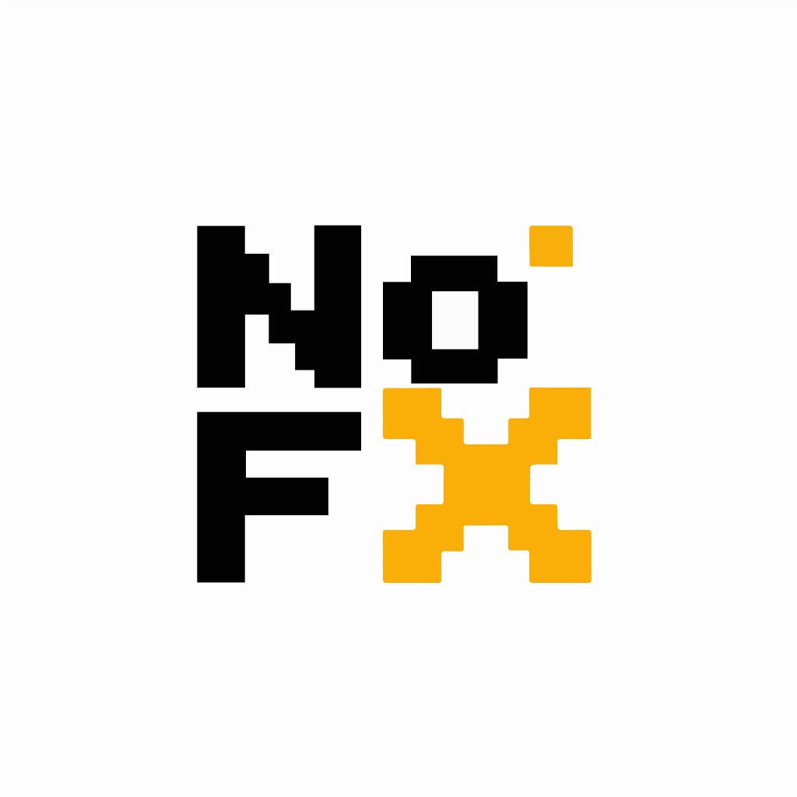

[Home](README.md) | [中文](README_中文.md) | [English](README_EN.md)

  
  <h1>nofxCG</h1>
  
<strong>A self-hosted security-focused fork of NOFX</strong>

  
Choose your preferred language below.

## Language Guide

- [中文文档](README_中文.md)
  中文完整版本，适合部署用户、中文访客和后续协作者。
- [English Documentation](README_EN.md)
  Full English version for international GitHub visitors, deployers, and contributors.

## Quick Note

- This repository homepage stays on `README.md` so GitHub can continue rendering a default landing page.
- The full Chinese content has been moved to [README_中文.md](README_中文.md).
- The full English content is available at [README_EN.md](README_EN.md).

## What You'll Find In The Full Docs

- Project positioning and differences from upstream `NOFX`
- Real product screenshots and architecture diagrams
- Linux and Windows deployment guides
- Auth, key rotation, backup, and restore operations
- Source development notes and contributor onboarding

## License

This project is based on upstream `NOFX` and continues to be distributed under `AGPL-3.0`. See [LICENSE](LICENSE) and [DISCLAIMER.md](DISCLAIMER.md).
