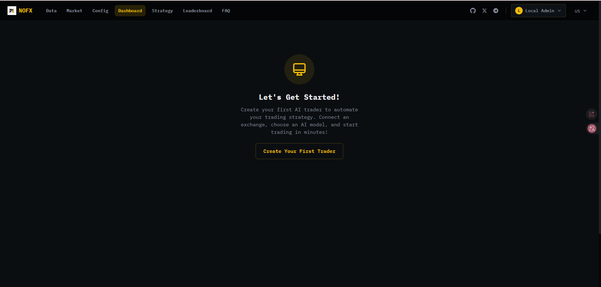
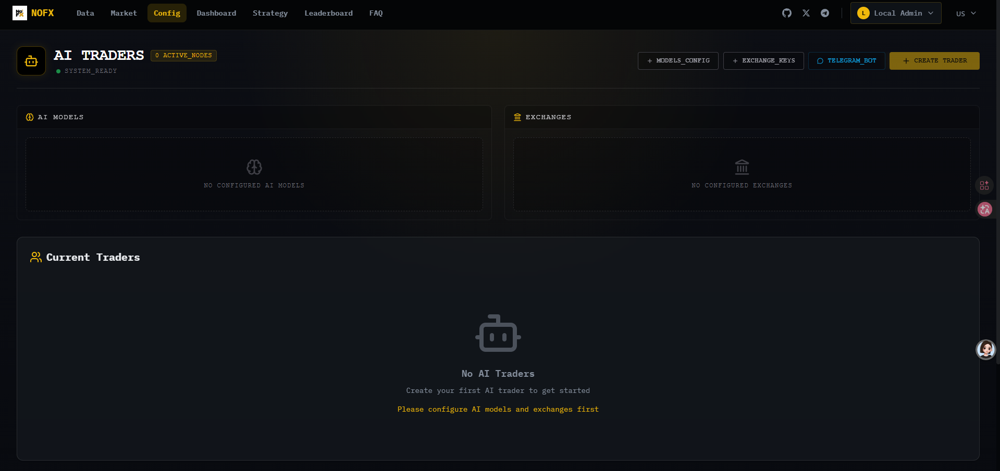
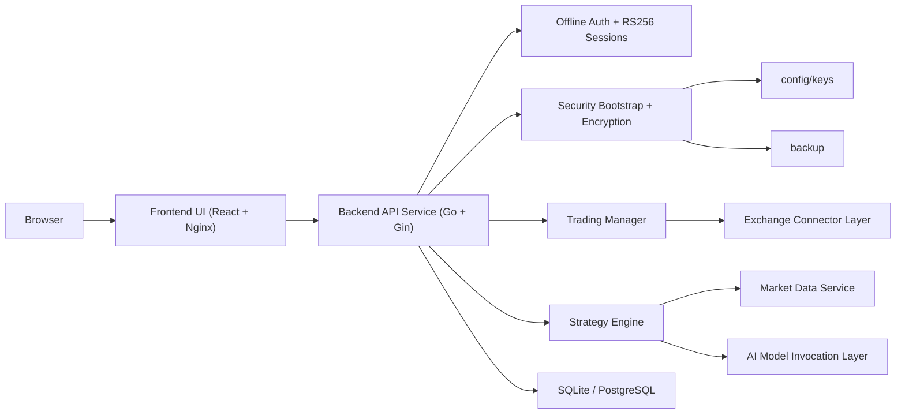
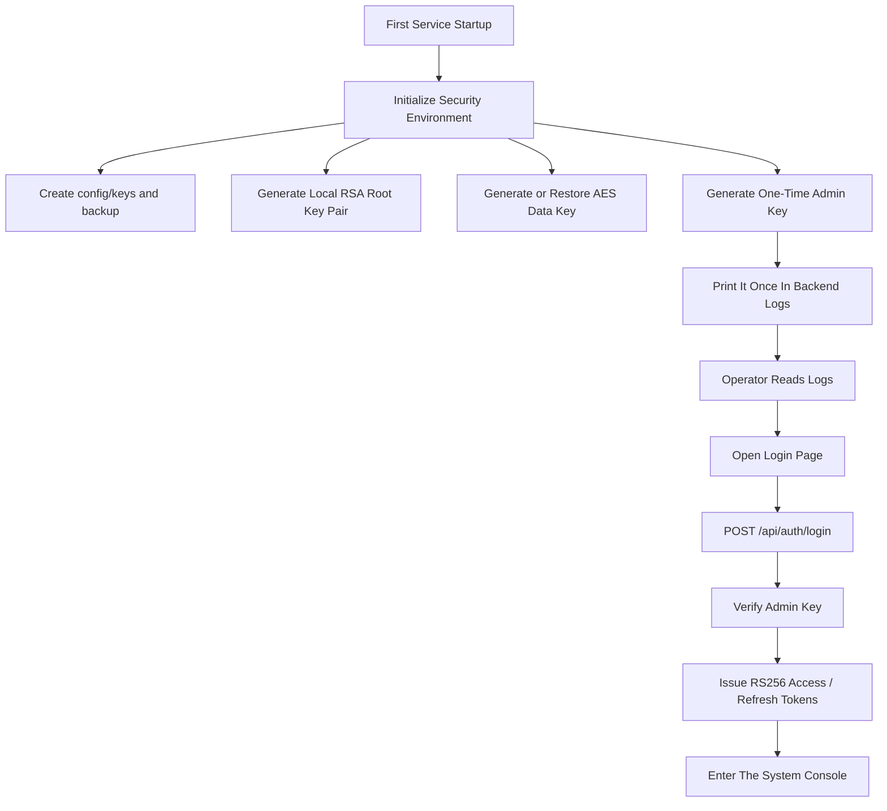
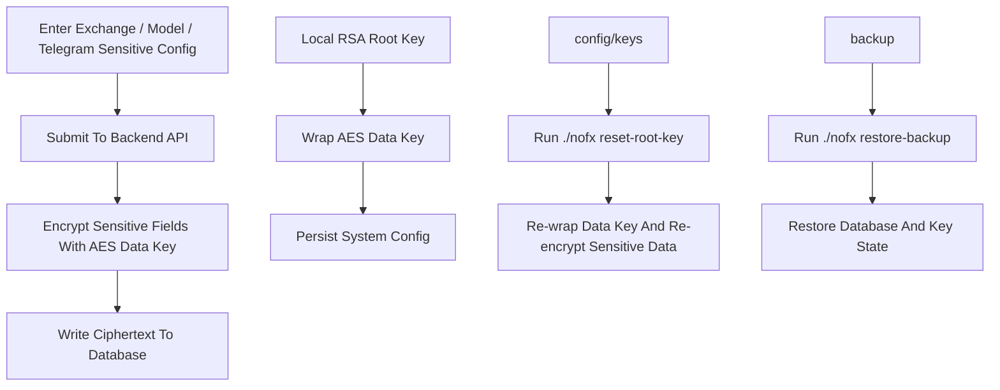
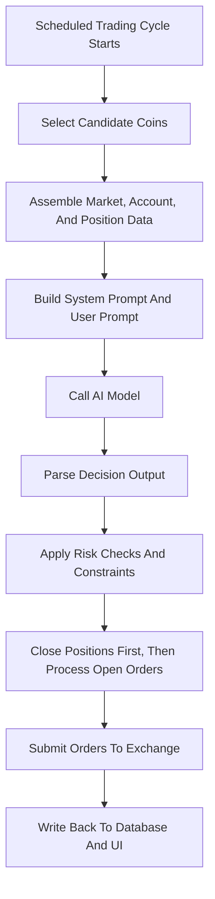

[English](README.md) | [中文](README_中文.md)

<div align="center">
  
  <h1>nofxCG</h1>
  <p><strong>A self-hosted, security-focused fork of NOFX</strong></p>
  <p>Built for single-node, private, and long-term operator-controlled deployments.</p>
  <p>Self-hosted first | Offline admin login | Local root keys | Recoverable ops | Open to contributors</p>
</div>

> This repository is an independent derivative of upstream NOFX. It is not the official upstream release.

- Current repository: [byQxo/nofxCG](https://github.com/byQxo/nofxCG)
- Upstream lineage: derived from `NOFX`

## Who This README Is For

- Deployers: focus on `Linux Deployment`, `Windows Deployment`, and `First Startup & Operations`.
- Open-source visitors: focus on `Project Positioning`, `Implemented Changes`, `Architecture Diagrams`, and `Comparison With Upstream NOFX`.
- Future contributors: focus on `Source Development`, `Documentation Index`, and `Roadmap & Collaboration`.

## Latest Runtime Screenshots

The following screenshots come from the current `Photo/` directory and reflect the real running UI of this fork rather than mockups.

<p align="center">
  
  <br />
  <sub>Landing page: product positioning, visual language, and overall system tone.</sub>
</p>

<table>
  <tr>
    <td align="center" width="50%">
      
      <br />
      <sub>Offline admin login: enter the one-time admin key printed in backend logs on first startup.</sub>
    </td>
    <td align="center" width="50%">
      
      <br />
      <sub>Dashboard console: the initial entry point after deployment.</sub>
    </td>
  </tr>
  <tr>
    <td align="center" width="50%">
      
      <br />
      <sub>Configuration overview: manage AI models, exchanges, and trader nodes in one place.</sub>
    </td>
    <td align="center" width="50%">
      
      <br />
      <sub>Model and exchange configuration: fine-grained setup for providers and exchange access.</sub>
    </td>
  </tr>
  <tr>
    <td align="center" colspan="2">
      
      <br />
      <sub>Strategy workbench: define trading mode, coin sources, exclusion rules, and prompt previews.</sub>
    </td>
  </tr>
</table>

## Project Positioning

`nofxCG` is an independent fork of `NOFX`. It does not try to replace every part of the upstream product direction. Instead, it narrows the default operating model to one core idea: `self-hosted + locally controlled + operationally recoverable`.

This repository is currently maintained primarily by a single person. Open-sourcing it is a practical decision: the long-term design, maintenance, and expansion workload is already beyond what a single maintainer should carry alone. As a result, this README is written not only for users, but also for future collaborators.

At the capability level, `nofxCG` still keeps the upstream trading-system foundation, including:

- multi-exchange connectivity
- multi-model support
- a strategy workbench and trading console
- a frontend/backend separated architecture
- an AI-driven automated trading workflow

What this fork emphasizes more strongly is:

- self-hosted and private deployment by default
- offline admin-key login by default
- local root-key management and encrypted sensitive persistence by default
- backup, rotation, and restore flows as first-class operational paths

## Implemented Changes

- Offline admin-key login: the service generates a one-time admin key on first startup and prints it to backend logs as the default login path.
- RS256 session model: access and refresh tokens are issued, refreshed, and validated with `RS256`.
- Local root-key directory: root keys live in `config/keys/` and are initialized and managed server-side.
- Encrypted persistence for sensitive settings: sensitive values are encrypted before storage instead of being written in plaintext.
- Recoverable operations: built-in support for `reset-admin-key`, `reset-root-key`, and `restore-backup`.
- In-repo FAQ data: FAQ content is shipped inside the repository so the frontend can render local FAQ data directly.

## Why This Fork Is Useful

- Better suited for single-node, self-hosted, intranet, or private deployments.
- Less dependent on cloud account registration and hosted account systems.
- More conservative about sensitive configuration and key handling.
- Clearer recovery paths for long-term operations.
- Easier to maintain as a solo-led project while still being modular enough for contributors to join.

## Architecture Diagrams

### 1. System Overview



### 2. First Startup & Offline Login



### 3. Sensitive Data Encryption & Recovery



### 4. Trading Decision Execution



## Comparison With Upstream NOFX

This table is not a "which one is better" verdict. It simply highlights how the default workflow and intended operating environment differ between upstream `NOFX` and `nofxCG`.

| Dimension | Upstream NOFX | nofxCG |
| :-- | :-- | :-- |
| Default auth model | More productized registration and onboarding flow | Offline admin-key login by default |
| Sensitive data handling | More general product configuration flow | Stronger emphasis on local root keys and encrypted persistence |
| Self-hosted / offline posture | Supports self-hosting but serves a broader product direction | Documentation and defaults lean harder toward private, operator-controlled deployment |
| Recovery operations | Provides general deployment materials | Explicit admin-key reset, root-key rotation, and backup restore paths |
| Local documentation posture | Broad, complete documentation footprint | Security and FAQ guidance are more tightly focused inside the repo |
| Best-fit scenario | Users following the broader upstream product route | Operators who prioritize local control, key safety, and recoverability |

## Linux Deployment

This is the recommended deployment path today.

### Minimal `.env`

```env
NOFX_BACKEND_PORT=8080
NOFX_FRONTEND_PORT=3000
TZ=Asia/Shanghai
DB_TYPE=sqlite
DB_PATH=data/data.db
```

Notes:

- In the recommended path, you do not need to pre-write the application master key into `.env`.
- On first startup, local root keys will be generated under `config/keys/`.
- `.env.example` still carries broader compatibility fields, but those are not the recommended security defaults for this fork.

### Startup Steps

1. Create `.env` in the repository root.
2. Make the helper script executable:

```bash
chmod +x start.sh
```

3. Start the service:

```bash
./start.sh start --build
```

4. Read backend logs and capture the one-time admin key printed during first startup:

```bash
./start.sh logs nofx
```

5. Open:

- Web UI: `http://localhost:3000`
- Health check: `http://localhost:8080/api/health`

### Equivalent `docker compose` Commands

```bash
docker compose up -d --build
docker compose logs -f nofx
docker compose down
```

### Directories You Must Back Up

- `config/keys`
- `backup`
- `data`

## Windows Deployment

For Windows, the recommended path is `Docker Desktop`. If you only want to deploy and use the system, stick to `docker compose`. If you want to develop the backend, use `WSL2` instead of native PowerShell as your primary backend environment.

### Startup Commands

```powershell
docker compose up -d --build
docker compose logs -f nofx
```

### Access Points

- Web UI: `http://localhost:3000`
- Health check: `http://localhost:8080/api/health`

### Stop The Service

```powershell
docker compose down
```

### Common Ops Commands

```powershell
docker compose exec nofx ./nofx reset-admin-key
docker compose exec nofx ./nofx reset-root-key
docker compose exec nofx ./nofx restore-backup <timestamp>
```

### Directories You Must Back Up

- `config/keys`
- `backup`
- `data`

## First Startup & Operations

### Public Entry Points & Auth APIs

| Entry | Address / Path | Purpose |
| :-- | :-- | :-- |
| Web UI | `http://localhost:3000` | Frontend control panel |
| Health check | `http://localhost:8080/api/health` | Backend liveness check |
| Login API | `POST /api/auth/login` | Admin-key login |
| Refresh API | `POST /api/auth/refresh` | Refresh access token |
| Logout API | `POST /api/auth/logout` | Explicit session revocation |
| Status API | `GET /api/auth/status` | Query current auth state |

### Common Operational Commands

| Scenario | Linux / Source Path | Docker Compose Path |
| :-- | :-- | :-- |
| View logs | `./start.sh logs nofx` | `docker compose logs -f nofx` |
| Reset admin key | `./start.sh reset-admin-key` or `./nofx reset-admin-key` | `docker compose exec nofx ./nofx reset-admin-key` |
| Rotate root key | `./start.sh reset-root-key` or `./nofx reset-root-key` | `docker compose exec nofx ./nofx reset-root-key` |
| Restore backup | `./start.sh restore-backup <timestamp>` or `./nofx restore-backup <timestamp>` | `docker compose exec nofx ./nofx restore-backup <timestamp>` |

After first startup, back up `./config/keys`, `./backup`, and `./data` immediately. For deeper details on the security chain, migration, and rollback model, read [ENCRYPTION_README.md](ENCRYPTION_README.md).

## Source Development

Recommended development environment:

- Go: `1.25.3`
- Node: `20+`
- Backend development: Linux or `WSL2`
- Frontend development: any normal Node-capable dev environment

### Backend

```bash
go run main.go
```

Direct operational commands are also available from source:

```bash
go run main.go reset-admin-key
go run main.go reset-root-key
go run main.go restore-backup <timestamp>
```

### Frontend

```bash
cd web
npm ci
npm run dev
```

Frontend dev server: `http://localhost:3000`

### Test Commands

```bash
make test
go test ./...
cd web && npm test
```

## Documentation Index

- [ENCRYPTION_README.md](ENCRYPTION_README.md): offline auth, root keys, encrypted persistence, backup, and recovery
- [docs/architecture/README.md](docs/architecture/README.md): system architecture overview
- [docs/architecture/STRATEGY_MODULE.md](docs/architecture/STRATEGY_MODULE.md): strategy module design
- [docs/guides/faq.en.md](docs/guides/faq.en.md): FAQ
- [docs/api/API_REFERENCE.md](docs/api/API_REFERENCE.md): API reference
- [CONTRIBUTING.md](CONTRIBUTING.md): contribution guide
- [DISCLAIMER.md](DISCLAIMER.md): risk and disclaimer notes

Additional notes:

- The FAQ page is available directly at `/faq`.
- FAQ data is currently bundled in `web/src/data/faqData.ts`.

## Roadmap & Collaboration

This fork is still primarily maintained by one person, and long-term contributors are genuinely welcome.

Priority collaboration areas:

- frontend UX and interaction cleanup
- exchange and AI provider integrations
- security review and recovery-path validation
- automated tests and regression coverage
- English/Chinese documentation refinement and internationalization

If you want to contribute, start with [CONTRIBUTING.md](CONTRIBUTING.md), then join through issues or pull requests.

## Developer Contact & Support

If you find this fork useful, you are welcome to support ongoing maintenance and development through the address below.

- Donation method: `TRON / TRC20 address`
- Address: `TGwxdHhB6EUY8sQvSknvVdbqnaS4RijDgd`
- Warning: `TRC20 network only. Verify the address and network before transfer.`

> Note: support is entirely voluntary and does not affect any rights you have under `AGPL-3.0`, including use, copying, modification, deployment, distribution, or access to corresponding source code.

## License & Legal

- This repository is based on upstream `NOFX` and continues to be distributed under `AGPL-3.0`.
- If you provide a network-accessible service based on this project, you still need to meet the corresponding source-availability obligations.
- `nofxCG` is an independent derivative and does not represent the official upstream position or claim upstream trademark ownership.
- For risks, disclaimers, and usage boundaries, read [DISCLAIMER.md](DISCLAIMER.md).
- For the full license text, read [LICENSE](LICENSE).
