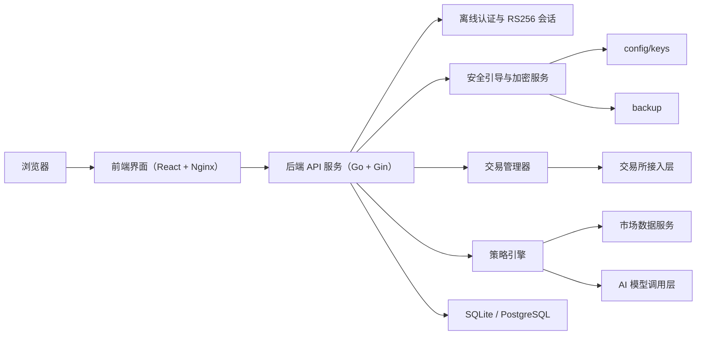
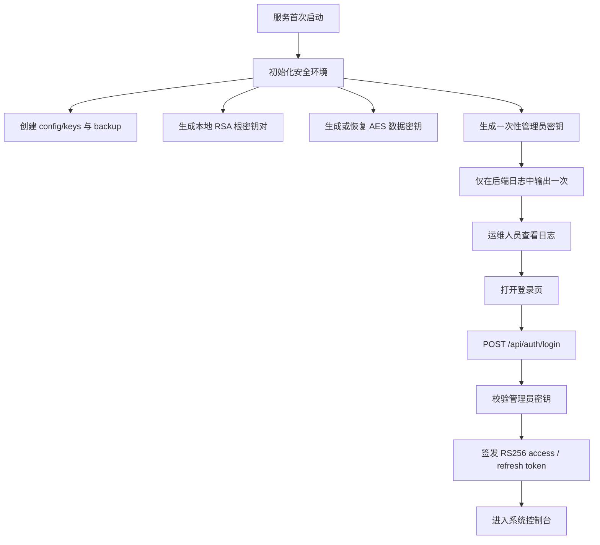
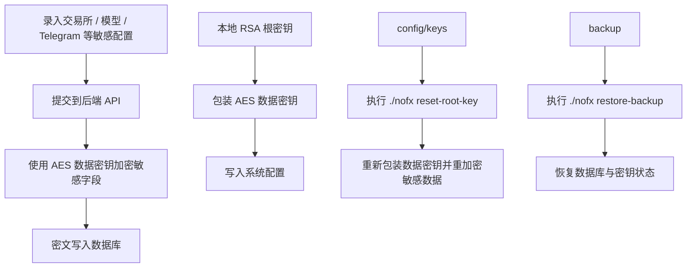
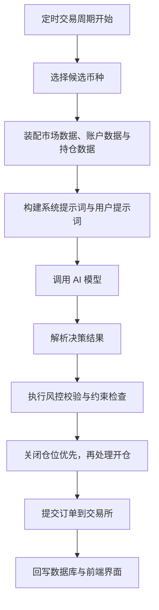

[首页](README.md) | [中文](README_中文.md) | [English](README_EN.md)

<div align="center">
  
  <h1>nofxCG</h1>
  <p><strong>基于 NOFX 的自托管安全增强分支</strong></p>
  <p>更适合单机、内网、私有化部署和长期自主运维</p>
  <p>🏠 自托管优先 · 🔐 离线管理员登录 · 🗝️ 本地根密钥 · ♻️ 可恢复运维 · 🤝 欢迎协作</p>
</div>

> 提示：这是基于 [NOFX](https://github.com/NoFxAiOS/nofx) 的独立衍生分支，不是上游官方版本。

- 当前仓库：[byQxo/nofxCG](https://github.com/byQxo/nofxCG)
- 上游仓库：[NoFxAiOS/nofx](https://github.com/NoFxAiOS/nofx)

## 👀 这份 README 适合谁

- 部署用户：重点阅读“Linux 部署”“Windows 部署”“首次启动与运维”。
- 开源访客：重点阅读“项目定位”“已实现改造”“实现逻辑图解”“与上游 NOFX 的克制对比”。
- 未来贡献者：重点阅读“源码开发附录”“文档索引”“发展路线与协作招募”。

## 🖼️ 最新运行截图

以下截图来自当前仓库的 `Photo/` 目录，展示的是当前分支的真实运行界面，而不是概念图。

<p align="center">
  
  <br />
  <sub>首页落地页：先展示产品定位、交易 OS 视觉语言和整体气质</sub>
</p>

<table>
  <tr>
    <td align="center" width="50%">
      
      <br />
      <sub>离线管理员登录：首次启动后通过日志中的管理员密钥进入系统</sub>
    </td>
    <td align="center" width="50%">
      
      <br />
      <sub>Dashboard 控制台：部署完成后的起步入口与引导页</sub>
    </td>
  </tr>
  <tr>
    <td align="center" width="50%">
      
      <br />
      <sub>配置总览：集中管理 AI Models、Exchanges 和 Trader 节点</sub>
    </td>
    <td align="center" width="50%">
      
      <br />
      <sub>模型与交易所配置：展示多模型来源与交易所接入的细粒度配置方式</sub>
    </td>
  </tr>
  <tr>
    <td align="center" colspan="2">
      
      <br />
      <sub>策略工作台：定义交易模式、币种来源、排除规则与 Prompt 预览</sub>
    </td>
  </tr>
</table>

## 🚀 项目定位

`nofxCG` 是基于 `NOFX` 的独立衍生分支。这个分支不试图替代上游的全部产品定位，而是把默认工作方式收紧到“自托管 + 本地控制 + 运维可恢复”。

这个仓库目前主要由单人推进。之所以选择开源，是因为项目设计、长期维护和后续扩展的工作量，已经超过单人持续独立维护的合理边界。这份 README 不只面向使用者，也明确面向未来可能加入的协作者。

在能力边界上，`nofxCG` 依然保留了上游的核心交易系统基础，例如：

- 多交易所接入能力
- 多模型调用能力
- 策略工作台与交易控制台
- 前后端分离架构
- AI 决策驱动的自动交易流程

但这个分支更强调以下事情：

- 默认以自托管和私有化部署为中心
- 默认以离线管理员密钥登录为中心
- 默认以本地根密钥和敏感数据加密落盘为中心
- 默认以备份、轮换、恢复这些运维链路为中心

## ✨ 已实现改造

- 离线管理员密钥登录：服务首次启动时生成一次性管理员密钥，并通过后端日志输出，用于默认登录路径。
- RS256 会话体系：使用 `RS256` access token / refresh token 进行会话签发、刷新与校验。
- 本地根密钥目录：根密钥默认落在 `config/keys/`，由服务端初始化和管理。
- 敏感配置加密落盘：敏感字段在服务端加密后写入数据库，而不是直接明文落盘。
- 运维恢复命令完善：提供 `reset-admin-key`、`reset-root-key`、`restore-backup` 等能力。
- FAQ 数据内置仓库：FAQ 内容已并入仓库，前端可直接渲染本地 FAQ 数据。

## 🌟 这个分支的核心优势

- 更适合单机、自托管、内网或私有化部署。
- 更少依赖云端注册与账号体系。
- 对敏感配置和密钥管理更保守。
- 运维恢复链路更明确，便于长期维护。
- 对单人维护项目更友好，也更容易吸引协作者分模块接手工作。

## 🧠 实现逻辑图解

### 1. 系统总架构



### 2. 首次启动与离线登录



### 3. 敏感数据加密与恢复



### 4. 交易决策执行



## 🔍 与上游 NOFX 的克制对比

下表不是“谁更强”的绝对判断，而是说明两个分支在默认工作方式和适用场景上的差异。

| 对比维度 | 上游 NOFX | nofxCG |
| :-- | :-- | :-- |
| 默认认证方式 | 更强调注册、引导和产品化工作流 | 默认离线管理员密钥登录 |
| 敏感信息保存方式 | 以更通用的产品配置流程为主 | 更强调本地根密钥与加密落盘 |
| 自托管与离线友好度 | 支持自托管，但面向更广泛的产品路线 | 文档和默认路径更偏向私有化与自主运维 |
| 运维恢复能力 | 提供通用部署资料 | 明确提供重置管理员密钥、轮换根密钥、恢复备份能力 |
| 本地文档可用性 | 文档完整，覆盖范围更广 | FAQ 数据与安全说明更集中在仓库内部 |
| 更适合的使用场景 | 希望紧跟上游完整产品路线的用户 | 更关注本地控制、密钥安全和恢复能力的操作者 |

## 🐧 Linux 部署

这是当前最推荐的部署方式。

### `.env` 最小示例

```env
NOFX_BACKEND_PORT=8080
NOFX_FRONTEND_PORT=3000
TZ=Asia/Shanghai
DB_TYPE=sqlite
DB_PATH=data/data.db
```

说明：

- 当前推荐路径下，不需要预先把应用主密钥写进 `.env`。
- 服务首次启动后会在 `config/keys/` 下生成本地根密钥。
- `.env.example` 仍保留更广泛的兼容字段，但不代表那是本分支当前最推荐的安全默认值。

### 启动步骤

1. 在仓库根目录创建 `.env`。
2. 赋予脚本执行权限：

```bash
chmod +x start.sh
```

3. 启动服务：

```bash
./start.sh start --build
```

4. 查看后端日志，读取首次启动输出的管理员密钥：

```bash
./start.sh logs nofx
```

5. 打开：

- Web UI：`http://localhost:3000`
- 健康检查：`http://localhost:8080/api/health`

### 等价 `docker compose` 命令

```bash
docker compose up -d --build
docker compose logs -f nofx
docker compose down
```

### 必须备份的目录

- `config/keys`
- `backup`
- `data`

## 🪟 Windows 部署

Windows 部署推荐 `Docker Desktop`。如果只是部署与使用，Windows 主路径全部使用 `docker compose`；如果要改后端源码，建议转到 `WSL2`，不要把原生 PowerShell 作为后端开发主环境。

### 启动命令

```powershell
docker compose up -d --build
docker compose logs -f nofx
```

### 访问地址

- Web UI：`http://localhost:3000`
- 健康检查：`http://localhost:8080/api/health`

### 停止服务

```powershell
docker compose down
```

### 常用运维命令

```powershell
docker compose exec nofx ./nofx reset-admin-key
docker compose exec nofx ./nofx reset-root-key
docker compose exec nofx ./nofx restore-backup <timestamp>
```

### 必须备份的目录

- `config/keys`
- `backup`
- `data`

## 🛠 首次启动与运维

### 公开入口与接口

| 入口 | 地址 / 路径 | 说明 |
| :-- | :-- | :-- |
| Web UI | `http://localhost:3000` | 前端控制台 |
| 健康检查 | `http://localhost:8080/api/health` | 检查后端存活状态 |
| 登录接口 | `POST /api/auth/login` | 管理员密钥登录 |
| 刷新接口 | `POST /api/auth/refresh` | 刷新 access token |
| 登出接口 | `POST /api/auth/logout` | 主动吊销会话 |
| 状态接口 | `GET /api/auth/status` | 查询当前认证状态 |

### 常用运维命令

| 场景 | Linux / 源码路径 | Docker Compose 路径 |
| :-- | :-- | :-- |
| 查看日志 | `./start.sh logs nofx` | `docker compose logs -f nofx` |
| 重置管理员密钥 | `./start.sh reset-admin-key` 或 `./nofx reset-admin-key` | `docker compose exec nofx ./nofx reset-admin-key` |
| 轮换根密钥 | `./start.sh reset-root-key` 或 `./nofx reset-root-key` | `docker compose exec nofx ./nofx reset-root-key` |
| 恢复备份 | `./start.sh restore-backup <timestamp>` 或 `./nofx restore-backup <timestamp>` | `docker compose exec nofx ./nofx restore-backup <timestamp>` |

首次启动完成后，建议立刻备份 `./config/keys`、`./backup`、`./data`。更详细的安全链路、迁移和回滚说明，请阅读 [ENCRYPTION_README.md](ENCRYPTION_README.md)。

## 👨‍💻 源码开发附录

推荐的源码开发组合：

- Go：`1.25.3`
- Node：`20+`
- 后端开发环境：Linux 或 `WSL2`
- 前端开发环境：任意支持 Node 的常规开发环境

### 后端

```bash
go run main.go
```

可直接调用的运维命令：

```bash
go run main.go reset-admin-key
go run main.go reset-root-key
go run main.go restore-backup <timestamp>
```

### 前端

```bash
cd web
npm ci
npm run dev
```

前端开发端口：`http://localhost:3000`

### 测试命令

```bash
make test
go test ./...
cd web && npm test
```

## 📚 文档索引

- [ENCRYPTION_README.md](ENCRYPTION_README.md)：离线认证、根密钥、加密落盘、备份恢复说明
- [docs/architecture/README.zh-CN.md](docs/architecture/README.zh-CN.md)：整体架构说明
- [docs/architecture/STRATEGY_MODULE.zh-CN.md](docs/architecture/STRATEGY_MODULE.zh-CN.md)：策略模块设计
- [docs/guides/faq.zh-CN.md](docs/guides/faq.zh-CN.md)：FAQ 文档
- [docs/api/API_REFERENCE.md](docs/api/API_REFERENCE.md)：API 参考
- [CONTRIBUTING.md](CONTRIBUTING.md)：贡献规范
- [DISCLAIMER.md](DISCLAIMER.md)：风险与免责声明

补充说明：

- FAQ 页面可直接通过 `/faq` 查看。
- FAQ 数据当前已内置到 `web/src/data/faqData.ts`。

## 🗺 发展路线与协作招募

这个仓库目前仍然是单人主导维护，欢迎愿意一起推进的人加入。

优先协作方向：

- 前端体验与交互整理
- 交易所与 AI Provider 适配
- 安全审计与恢复链路验证
- 自动化测试与回归测试补齐
- 中文文档与国际化完善

如果你想参与，请先阅读 [CONTRIBUTING.md](CONTRIBUTING.md)，再通过 Issue 或 PR 进入协作。

## ☕️ 开发者联系与赞赏

如果你希望直接联系开发者，反馈问题、交流想法或讨论合作，可以扫描下面的个人微信二维码。

如果你认可这个分支的改造方向，也欢迎使用赞赏码自愿支持项目维护与开发。

<table>
  <tr>
    <td align="center" width="50%">
      
      <br />
      <sub>开发者联系码：用于项目交流、问题反馈与合作沟通</sub>
    </td>
    <td align="center" width="50%">
      
      <br />
      <sub>微信赞赏码：完全自愿，仅用于支持项目维护与开发</sub>
    </td>
  </tr>
</table>

> 说明：赞赏完全自愿，不影响任何人在 `AGPL-3.0` 下对本项目的使用、复制、修改、部署、分发和获取对应源码的权利。

## ⚖️ 许可证与法律说明

- 本仓库基于上游 `NOFX`，继续在 `AGPL-3.0` 条件下发布。
- 如果你基于本项目提供网络可交互服务，仍需履行对应源码提供义务。
- `nofxCG` 是独立衍生分支，不代表上游官方立场，也不声称拥有上游商标权。
- 风险提示、免责说明与使用边界，请阅读 [DISCLAIMER.md](DISCLAIMER.md)。
- 完整许可证文本请阅读根目录 [LICENSE](LICENSE)。
